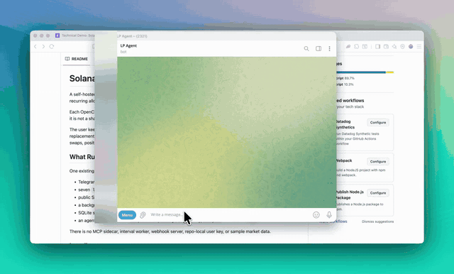

# Solana LP Manager for OpenClaw

A self-hosted OpenClaw plugin that manages an Orca Whirlpool position with capital bounded by a Solana Native recurring allowance.

Each OpenClaw installation is intentionally single-owner. The project can be installed by many users independently; it is not a shared custodial SaaS and does not commingle owners in one agent wallet or database.

The user keeps their wallet and private key outside this application. Their wallet signs only allowance creation, cap replacement, and revocation through Solana Actions/Blinks. A local agent wallet signs allowance pulls, balancing swaps, position opens, closes, and rebalances. The on-chain recurring delegation is the spending boundary.



## What Runs

One existing OpenClaw Gateway process owns:

- Telegram conversation and inline buttons
- seven `lp_manager_*` agent tools
- public Solana Action routes
- a background Orca account subscription and Pyth monitor
- SQLite state under `~/.openclaw/lp-manager`
- an agent-only keypair at `~/.openclaw/lp-manager/agent-keypair.json` with mode `0600`

There is no MCP sidecar, interval worker, webhook server, repo-local user key, or sample market data.

## Install

Requirements: Node.js 22+, an existing OpenClaw installation with Telegram configured, and a public HTTPS URL that forwards to the OpenClaw Gateway.

```bash
npm ci
PUBLIC_BASE_URL=https://your-host.example npm run openclaw:install
openclaw gateway run
```

For the current Tailscale host, forward HTTPS to the Gateway port:

```bash
sudo tailscale serve --bg http://127.0.0.1:18789
```

The gateway is the only long-running process. Confirm the plugin before using funds:

```bash
npm run openclaw:inspect
curl https://your-host.example/actions.json
```

## Telegram Flow

Tell the existing OpenClaw Telegram bot, in ordinary language:

```text
Manage an Orca SOL/USDC position with up to 5 USDC per week.
My public wallet is <wallet>, the allowance mint is <mint>, and the Whirlpool is <address>.
```

OpenClaw will:

1. Call `lp_manager_authorize` and send a wallet-signable Blink.
2. Verify the confirmed transaction and exact on-chain delegation before activating it.
3. Validate that the Whirlpool is the configured wrapped SOL/USDC pair, has liquidity, and is close to the configured Pyth SOL/USD price.
4. Pull only a score-sized fraction of the remaining recurring cap.
5. Balance the input token through the selected Whirlpool and open a confirmed position.
6. Watch the Whirlpool account over Solana WebSocket, close and recenter near/outside the configured range, then notify Telegram.

Status replies use actual Orca position accounts and include ticks, prices, token amounts, fees owed, range state, allowance state, and confirmed signatures. Unsupported PnL/APR values are reported as unknown rather than synthesized.

## Authority Changes

The agent cannot increase its own allowance or revoke the owner's authority. These tools return new Blinks:

- `lp_manager_change_allowance`
- `lp_manager_stop`

Action completion is idempotent and accepted only after the application confirms the signature, owner signer, and resulting delegation account on Solana.

## Production Configuration

Plugin config lives at `plugins.entries.lp-manager.config` in OpenClaw:

```json5
{
  cluster: "devnet",
  rpcUrl: "https://api.devnet.solana.com",
  publicBaseUrl: "https://your-host.example",
  maxOracleAgeSeconds: 30,
  oracleQuoteMint: "BRjpCHtyQLNCo8gqRUr8jtdAj5AjPYQaoqbvcZiHok1k",
  maxPoolOracleDeviationBps: 500,
  monitorIntervalSeconds: 30,
  minimumAgentSol: 0.02,
  notificationsEnabled: true,
  notificationSessionKey: "agent:main:main",
  notificationTelegramChatId: "<telegram-chat-id>"
}
```

`notificationTelegramChatId` lets a completed wallet signature immediately acknowledge the owner and continue the pending LP operation through Telegram.

`mainnet-beta` additionally requires `enableMainnet: true`. Use a dedicated production RPC/WebSocket provider, review dependency advisories, and complete an end-to-end small-value rollout before enabling mainnet.

## Verification

```bash
npm test
npm run typecheck
npm run build
npx openclaw config validate
npx openclaw secrets audit --check
npm audit --omit=dev
```

The public Orca Devnet pools can be stale or far from Pyth. This application intentionally refuses to deploy when the pool/oracle deviation exceeds policy; use a healthy pool or initialize a correctly priced Devnet pool for end-to-end testing.

The current production dependency tree contains unresolved upstream advisories in Solana Agent Kit and the legacy Orca Web3 SDK stack. Do not enable mainnet until those advisories are removed or formally accepted after an independent security review.

## Recording Setup

Public Devnet pools can be stale. For a deterministic recording, prepare a real Orca Devnet pool backed by a clearly labeled test-only quote mint. The script uses the existing agent key, a separate seed-liquidity wallet, live Pyth pricing, and real on-chain transactions. It never reads or stores the user's private key.

```bash
export RECORDING_USER_WALLET=<public-wallet>
npm run recording:check
npm run recording:prepare
```

The readiness check prints the agent wallet and any additional Devnet SOL needed. Fund that address, rerun `recording:prepare`, then restart the existing OpenClaw Gateway. The command prints the generated quote mint, Whirlpool, and exact Telegram prompts. Recording assets and the seed-wallet key are stored with private permissions under `~/.openclaw/lp-manager/recording`.

After setup, `recording:check` verifies the mint, Orca-owned pool and seed-position accounts, the user's token balance, live Pyth price, and pool/oracle deviation. It reports `ready: true` only when the recording environment is usable.
